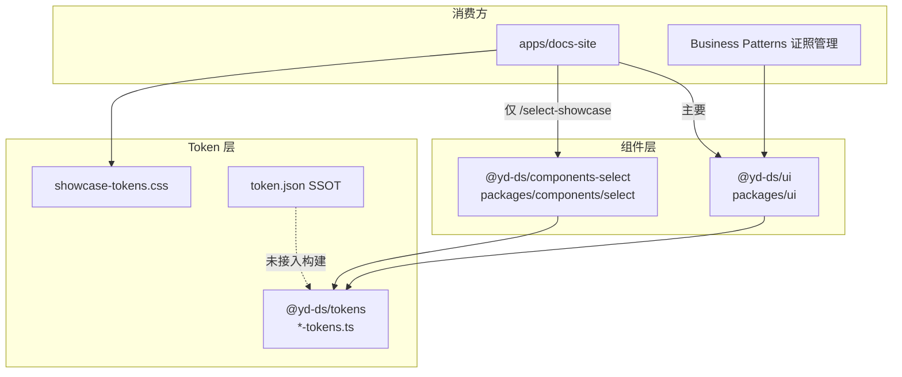

# YD Design System — 组件架构审计报告

> **审计范围**：`packages/ui`、`packages/components/*`、`apps/docs-site`、`apps/docs/*`、Showcase 相关资源  
> **约束**：只读分析，不包含代码改动  
> **审计日期**：2026-06-04  
> **关联文档**：`docs/token-migration-plan.md`、`packages/tokens/token-architecture.md`

---

## 1. 执行摘要

当前 monorepo 以 **`@yd-ds/ui`（`packages/ui`）** 为事实上的组件主库，文档站 **`apps/docs-site`** 消费该库并承载全部官方组件文档与 Showcase。

**已确认的双轨风险仅集中在 Select**：存在第二套实现 `@yd-ds/components-select`（`packages/components/select`）及独立路由 `/select-showcase`。Button、Input、Checkbox、Radio 等 **无** `packages/components/*` 平行包，但普遍存在 **「组件实现 + Token TS + showcase CSS」三轨** 的 Token 维护问题。

**目标态**：业务与文档 **只引用 `@yd-ds/ui`**；Token 由 `token.json` → `@yd-ds/tokens` 单源生成；Showcase 内嵌于 `apps/docs-site/app/components/<name>/`，不另起组件包或平行路由。

---

## 2. 架构总览（现状）



| 层级 | 路径 | 职责 |
|------|------|------|
| 组件实现 | `packages/ui/src/components/*.tsx` | 运行时 UI，按子路径导出 |
| 平行组件（异常） | `packages/components/select/` | Select 第二实现 + 单测 |
| 设计 Token | `packages/tokens/src/primitives/*-tokens.ts` | 组件/基础 Token 常量 |
| 文档站 CSS | `apps/docs-site/styles/showcase-tokens.css` | ~300+ `--*` 变量，与 TS Token 镜像 |
| 文档与 Showcase | `apps/docs-site/app/**` | Next.js 页面 + `*-showcase.tsx` |
| 外挂 Showcase 源 | `apps/docs/select-showcase/` | 被 docs-site 跨目录 import |

---

## 3. A. 当前已存在的组件清单

### 3.1 `packages/ui` — 组件实现（权威列表）

| 组件 | 源文件 | 包导出路径 | 文档路由 | `ready` |
|------|--------|------------|----------|---------|
| Button | `button.tsx` | `@yd-ds/ui`、`@yd-ds/ui/button` | `/components/button` | ✓ |
| Card | `card.tsx` | `@yd-ds/ui`、`@yd-ds/ui/card` | `/components/card` | ✓ |
| Link | `link.tsx` | `@yd-ds/ui/link` | `/components/link` | ✓ |
| Input | `input.tsx` | `@yd-ds/ui/input` | `/components/input` | ✓ |
| Select | `select.tsx` | `@yd-ds/ui/select` | `/components/select` | ✓ |
| Radio | `radio.tsx` | `@yd-ds/ui/radio` | `/components/radio` | ✓ |
| Checkbox | `checkbox.tsx` | `@yd-ds/ui/checkbox` | `/components/checkbox` | ✓ |
| Switch | `switch.tsx` | `@yd-ds/ui/switch` | `/components/switch` | ✓ |
| Tabs | `tabs.tsx` | `@yd-ds/ui/tabs` | `/components/tabs` | ✓ |
| DatePicker | `date-picker.tsx` | `@yd-ds/ui/date-picker` | `/components/date-picker` | ✓ |
| TimePicker | `time-picker.tsx` | `@yd-ds/ui/time-picker` | `/components/time-picker` | ✓ |
| Upload | `upload.tsx` | `@yd-ds/ui/upload` | `/components/upload` | ✓ |
| Table | `table.tsx` | `@yd-ds/ui/table` | `/components/table` | ✓ |
| Modal | `modal.tsx` | `@yd-ds/ui/modal` | `/components/modal` | ✓ |
| Drawer | `drawer.tsx` | `@yd-ds/ui/drawer` | `/components/drawer` | ✓ |
| Message | `message.tsx` | `@yd-ds/ui/message` | `/components/message` | ✓ |
| Cascader | — | — | `/components/cascader`（导航占位） | ✗ |

**辅助模块（非独立导航组件）**

| 模块 | 文件 | 说明 |
|------|------|------|
| TablePagination | `table-pagination.tsx` | 表格分页 |
| TableActions | `table-actions.tsx` | 表格操作列链接样式 |
| TableBusinessPatterns | `table-business-patterns.tsx` | 证照等业务表格模式 |
| DatePickerData | `date-picker-data.ts` | 日期数据工具 |

**根入口 `packages/ui/src/index.ts` 仅导出**：`Button`、`Card`、`Link`、`cn`。其余组件 **必须** 使用子路径（如 `@yd-ds/ui/select`），与文档示例一致。

### 3.2 `packages/components/*` — 平行组件包

| 包名 | 路径 | 内容 |
|------|------|------|
| `@yd-ds/components-select` | `packages/components/select/` | `Select.tsx`、`SelectOption.tsx`、`select-tokens.ts`、测试、Stories |

**仅此 1 个** 子包；无 `button`、`input`、`checkbox`、`radio` 等平行实现。

### 3.3 `packages/tokens` — 组件 Token 文件

| Token 文件 | 对应组件 |
|------------|----------|
| `select-tokens.ts` | Select |
| `checkbox-tokens.ts` | Checkbox |
| `radio-tokens.ts` | Radio |
| `switch-tokens.ts` | Switch |
| `tabs-tokens.ts` | Tabs |
| `datepicker-tokens.ts` | DatePicker |
| `timepicker-tokens.ts` | TimePicker |
| `upload-tokens.ts` | Upload |
| `table-tokens.ts` | Table |
| `modal-tokens.ts` | Modal |
| `drawer-tokens.ts` | Drawer |
| `message-tokens.ts` | Message |
| `link-colors.ts` | Link |

Button、Input、Card **无** 独立 `*-tokens.ts`（Button/Input 部分依赖 Tailwind 语义色 + `showcase-tokens.css` 品牌变量）。

### 3.4 `apps/docs-site` — 文档与 Showcase 页面

| 类型 | 路径模式 | 数量 |
|------|----------|------|
| 组件文档页 | `app/components/<name>/page.tsx` | 16 个 ready 组件 + 索引重定向 |
| 组件 Showcase | `app/components/<name>/*-showcase.tsx` | 14 个（含 table/upload/message 等） |
| 基础规范 | `app/foundations/*` | colors、text、grid、container、tokens |
| 业务模式 | `app/business-patterns/certificate-management` | 1 个 |
| **平行 Showcase 路由** | `app/select-showcase/page.tsx` | 1 个（非组件导航） |

### 3.5 Showcase 文件清单（docs-site 内）

| Showcase 文件 | 消费组件来源 |
|---------------|--------------|
| `select/select-showcase.tsx` | `@yd-ds/ui/select` |
| `checkbox/checkbox-showcase.tsx` | `@yd-ds/ui/checkbox` |
| `radio/radio-showcase.tsx` | `@yd-ds/ui/radio` |
| `switch/switch-showcase.tsx` | `@yd-ds/ui/switch` |
| `tabs/tabs-showcase.tsx` | `@yd-ds/ui/tabs` |
| `date-picker/date-picker-showcase.tsx` | `@yd-ds/ui/date-picker` |
| `time-picker/time-picker-showcase.tsx` | `@yd-ds/ui/time-picker` |
| `upload/upload-showcase.tsx` | `@yd-ds/ui/upload` |
| `table/table-showcase.tsx` | `@yd-ds/ui/table` |
| `table/business-table-showcase.tsx` | `@yd-ds/ui/table` |
| `modal/modal-showcase.tsx` | `@yd-ds/ui/modal` |
| `drawer/drawer-showcase.tsx` | `@yd-ds/ui/drawer` |
| `message/message-showcase.tsx` | `@yd-ds/ui/message` |

Input、Button、Link、Card 的演示逻辑主要在 `page.tsx` 或共享组件（如 `input-showcase-frame.tsx`），无独立 `*-showcase.tsx` 文件名。

### 3.6 外挂 Showcase（`apps/docs`）

| 路径 | 说明 |
|------|------|
| `apps/docs/select-showcase/select-showcase-page.tsx` | 使用 `@yd-ds/components-select` |
| `apps/docs-site/app/select-showcase/page.tsx` | 仅 re-export 上述页面 |

该路由 **未** 出现在 `component-navigation.ts` 侧栏中，用户易遗漏，且与 `/components/select` 形成双入口。

---

## 4. B. 是否存在重复实现

### 4.1 组件实现层（Runtime）

| 组件 | `packages/ui` | `packages/components/*` | 结论 |
|------|---------------|-------------------------|------|
| **Select** | ✓ `select.tsx` (~456 行) | ✓ `Select.tsx` (~446 行) | **重复实现** |
| Button | ✓ | ✗ | 单轨 |
| Input | ✓ | ✗ | 单轨 |
| Checkbox | ✓ | ✗ | 单轨 |
| Radio | ✓ | ✗ | 单轨 |
| 其余 11+ 组件 | ✓ | ✗ | 单轨 |

**Select 差异摘要**（合并前需对齐）：

| 能力 | `@yd-ds/ui/select` | `@yd-ds/components-select` |
|------|--------------------|----------------------------|
| 单选 / 多选 | ✓ | ✓ |
| 搜索 | ✓ | ✓ |
| 清空 | ✓ | ✓ |
| 禁用 | ✓ | ✓ |
| Placeholder | ✓ | ✓ |
| **Option Group** | ✗ | ✓ |
| `showcaseState` 静态矩阵 | ✓ `SelectShowcase` | ✗ |
| `withCreate` 多选增项 | ✓ | ✗ |
| 受控 `open` | 仅 showcase 模拟 | ✓ `open` / `onOpenChange` |
| 单元测试 | ✗ | ✓ `Select.test.tsx` |

### 4.2 Token 层（非组件源码，但属双轨）

| 组件 | `@yd-ds/tokens` `*-tokens.ts` | `packages/components/select/select-tokens.ts` | `showcase-tokens.css` |
|------|------------------------------|------------------------------------------------|------------------------|
| Select | ✓ | ✓（重复常量） | ✓ `--select-*` |
| Checkbox / Radio / … | ✓ | ✗ | ✓ 同名变量 |
| Button / Input | 部分 / 无专门文件 | ✗ | ✓ `--color-brand*` 等 |

组件运行时读 **CSS 变量**；文档与导出读 **TS 常量** → 改 Token 需改两处（TS + CSS），属 **隐性双轨**。

### 4.3 文档 / Showcase 层

| 入口 | 组件来源 | 状态 |
|------|----------|------|
| `/components/select` | `@yd-ds/ui/select` | 官方导航、完整文档结构 |
| `/select-showcase` | `@yd-ds/components-select` | 平行路由、无侧栏链接 |
| 证照管理等业务页 | `@yd-ds/ui/select` | 生产路径正确 |

### 4.4 `*Showcase` 嵌套组件模式（ui 内）

多个 ui 组件导出 `XxxShowcase` + `showcaseState`，用于文档 **静态规格矩阵**（pointer-events-none）。与真实交互组件共存于同一文件，**非第二套实现**，但增加 API 表面积，合并 Select 时需保留或抽离到 docs-only 层。

涉及文件：`select`、`checkbox`、`radio`、`switch`、`tabs`、`date-picker`、`time-picker`、`upload` 等。

---

## 5. C. 哪些组件应保留

### 5.1 必须保留（单一实现源）

**全部保留在 `packages/ui`**，作为唯一运行时组件库：

- 表单：Button、Input、Select、Radio、Checkbox、Switch、Tabs、DatePicker、TimePicker、Upload  
- 反馈：Message、Modal、Drawer  
- 数据：Table（含 pagination、actions、business patterns）  
- 基础：Card、Link  

**保留 `packages/tokens`** 作为设计 Token 源（目标态由 `token.json` 生成，见 token-migration-plan）。

**保留 `apps/docs-site`** 作为唯一文档应用；Showcase 继续放在 `app/components/<name>/`。

**保留业务模式** `business-patterns/certificate-management`（验证真实组合场景，应继续只 import `@yd-ds/ui`）。

### 5.2 建议保留但需收敛

| 项 | 保留理由 | 收敛动作（后续） |
|----|----------|------------------|
| `packages/ui` 内 `*Showcase` / `showcaseState` | 文档静态态矩阵成熟 | 可迁至 `docs-site` 专用 wrapper，减小 ui 公共 API |
| `table-business-patterns.tsx` | 业务示范与 Pattern 02 对齐 | 保留在 ui 或迁至 `docs-site/lib/patterns` |
| `token.json` + `src/ssot` | SSOT 方向已建立 | 按 migration plan 生成 tokens |
| `Select.test.tsx` 模式 | 有价值 | 合并后测试放在 `packages/ui` |

---

## 6. D. 哪些组件应废弃

### 6.1 建议废弃（明确）

| 项 | 路径 | 原因 |
|----|------|------|
| **`@yd-ds/components-select` 整包** | `packages/components/select/` | 与 `ui/select` 重复；仅服务 `/select-showcase` |
| **`apps/docs/select-showcase/`** | 外挂源码目录 | 应并入 `docs-site/app/components/select` |
| **路由 `/select-showcase`** | `app/select-showcase/page.tsx` | 与官方组件文档重复；无导航 |
| **`packages/components/select/select-tokens.ts`** | 组件包内 Token | 与 `tokens/src/primitives/select-tokens.ts` 重复 |
| **导航项 Cascader（未实现）** | `component-navigation` `ready: false` | 无代码；保留占位或删除直至实现 |

### 6.2 不建议废弃但应标记 legacy

| 项 | 说明 |
|----|------|
| `@yd-ds/ui/select` 中 `SelectShowcase` + `showcaseState` | 文档专用；废弃包前将能力合并进 ui 或 docs |
| `SelectLegacyRowShowcase`（docs） | 历史布局演示；合并 Option Group 后可删 |

### 6.3 勿废弃

- `@yd-ds/ui` 主库及现有子路径导出契约  
- `apps/docs-site` 下 `/components/*` 官方文档  
- `showcase-tokens.css`（短期保留，长期改为生成物）

---

## 7. E. 推荐的最终目录结构

### 7.1 目标 monorepo 布局

```text
yd-design-system/
├── packages/
│   ├── tokens/
│   │   ├── token.json                 # SSOT（唯一手写源）
│   │   ├── scripts/generate-tokens.mjs
│   │   ├── src/
│   │   │   ├── generated/             # 由 JSON 生成，只读
│   │   │   ├── semantic/
│   │   │   ├── primitives/            # 逐步变薄 → re-export generated
│   │   │   └── index.ts
│   │   └── index.ts                   # SSOT 运行时 flat API（可选保留）
│   │
│   ├── ui/                            # ★ 唯一组件实现库
│   │   ├── src/
│   │   │   ├── components/
│   │   │   │   ├── button.tsx
│   │   │   │   ├── input.tsx
│   │   │   │   ├── select/            # 建议：目录化（合并后）
│   │   │   │   │   ├── select.tsx
│   │   │   │   │   ├── select-option.tsx
│   │   │   │   │   └── select.types.ts
│   │   │   │   └── ...
│   │   │   ├── lib/
│   │   │   └── index.ts
│   │   └── package.json               # 仅 @yd-ds/ui 导出
│   │
│   ├── themes/                        # 主题 Provider + themes.css
│   └── typescript-config/
│
├── apps/
│   └── docs-site/                     # ★ 唯一文档应用
│       ├── app/
│       │   ├── components/
│       │   │   └── <component>/
│       │   │       ├── page.tsx
│       │   │       ├── <component>-showcase.tsx
│       │   │       └── <component>-page-nav.tsx   # 按需
│       │   ├── foundations/
│       │   └── business-patterns/
│       ├── lib/data/                  # *Mock.ts 文档数据
│       ├── styles/
│       │   ├── showcase-tokens.css    # 中期：generated
│       │   └── ...
│       └── components/                # 站点壳层（sidebar、docs-search）
│
└── docs/
    ├── token-migration-plan.md
    ├── component-architecture-audit.md
    └── ...
```

**删除目标**（合并完成后）：

```text
packages/components/                   # 整目录移除
apps/docs/                             # 整目录移除（select-showcase 迁入 docs-site）
apps/docs-site/app/select-showcase/    # 路由移除
```

### 7.2 包与导入契约（目标态）

| 用途 | 唯一导入 |
|------|----------|
| 业务 / 文档组件 | `@yd-ds/ui` 或 `@yd-ds/ui/<component>` |
| 设计 Token 常量 | `@yd-ds/tokens` |
| SSOT 查询 / CI | `@yd-ds/tokens/json` |
| 主题 | `@yd-ds/themes` |
| **禁止** | `@yd-ds/components-*` |

`next.config.ts` 的 `transpilePackages` 仅需：`@yd-ds/ui`、`@yd-ds/tokens`、`@yd-ds/themes`。

### 7.3 Select 合并建议（消除双轨的操作顺序）

1. 将 `Option Group`、`open/onOpenChange`、测试用例 **并入** `packages/ui/src/components/select.tsx`（或目录化拆分）。  
2. 文档 `select-showcase.tsx` 增加 **Grouped Options** 区块；删除 `/select-showcase` 路由与 `apps/docs/`。  
3. 删除 `packages/components/select`，从 `pnpm-workspace` 与 `docs-site/package.json` 移除依赖。  
4. 删除 `packages/components/select/select-tokens.ts`，统一使用 `@yd-ds/tokens` 的 `select-tokens`。  
5. 更新 `selectMock.ts` 代码示例，只保留 `@yd-ds/ui/select`。

---

## 8. 风险矩阵

| 风险 | 严重度 | 现状 | 目标 |
|------|--------|------|------|
| Select 双实现 | **高** | ui + components-select | 仅 ui |
| Select 双文档路由 | **中** | /components/select + /select-showcase | 仅前者 |
| Token TS/CSS 双轨 | **高** | 全组件 | JSON 生成 + 单 CSS 管道 |
| ui 内 Showcase API 泄漏 | **低** | 多组件 | 文档专用层或明确 `@internal` |
| Cascader 空导航 | **低** | ready: false | 实现或移除导航 |
| 根 index 导出不全 | **低** | 仅 Button/Card/Link | 文档已用子路径，可维持 |

---

## 9. 审计结论表（C/D 速查）

| 资产 | 保留 / 废弃 |
|------|-------------|
| `packages/ui` 全部已实现组件 | **保留**（唯一组件库） |
| `packages/components/select` | **废弃**（合并后删除） |
| `apps/docs/select-showcase` | **废弃**（迁入 components/select 文档） |
| `/select-showcase` 路由 | **废弃** |
| `packages/tokens/*-tokens.ts` | **保留**（收敛为 generated） |
| `showcase-tokens.css` | **保留 → 生成** |
| `apps/docs-site/app/components/*` | **保留** |
| Button / Input / Checkbox / Radio 在 ui 的实现 | **保留**，无平行包 |

---

## 10. 附录：依赖关系抽样

**生产路径（应维持）**

- `certificate-management-view.tsx` → `@yd-ds/ui/select`、`button`、`input`、`table`  
- `providers.tsx` → `@yd-ds/ui/message`  
- 各 `*-showcase.tsx` → 对应 `@yd-ds/ui/<component>`

**异常路径（应消除）**

- `select-showcase-page.tsx` → `@yd-ds/components-select`  
- `docs-site/package.json` → `"@yd-ds/components-select": "workspace:*"`

---

*本报告为架构审计交付物；实施合并时请单独开 PR，并配合 `docs/token-migration-plan.md` 统一 Token 管道。*
