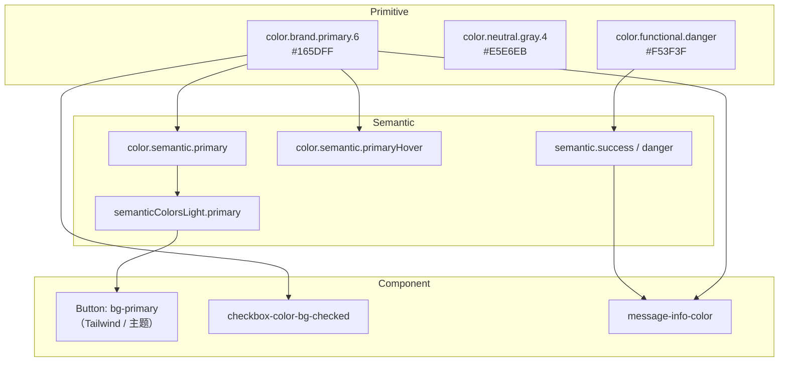
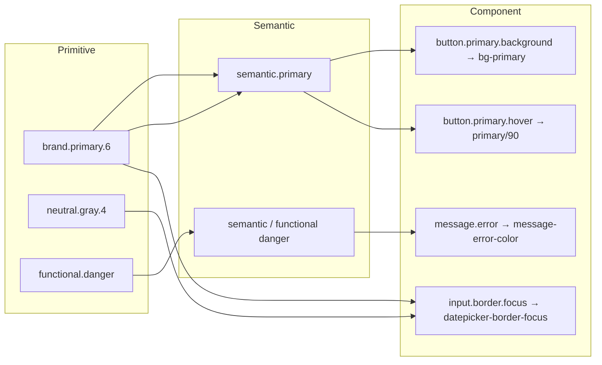

# YD Design Token 架构说明

> **数据源**：`packages/tokens/token.json`（176 个叶子 Token）  
> **运行时实现**：`packages/tokens/src/` → `@yd-ds/tokens` → `packages/themes` CSS 变量 → `apps/docs-site/styles/showcase-tokens.css`  
> **生成时间**：2026-06-04（与 `token.json` `$metadata.generatedAt` 对齐）  
> **审计方法**：对照 `token.json` 与 `src/primitives/*`、`src/semantic/*`、各 `*-tokens.ts` 及文档站 CSS 的静态引用关系（2026-06-01 复核）

---

## 1. 三层模型总览

| 层级 | 职责 | 在 `token.json` 中的位置 | 在代码库中的主要落点 |
|------|------|--------------------------|----------------------|
| **Primitive（原子）** | 与 UI 角色无关的原始值：色阶、间距刻度、字号、阴影物理量 | `color.brand.primary.*`、`spacing.scale.*`、`radius.*`、`typography.*`、`shadow.elevation.*` | `src/primitives/colors.ts`（`brandPrimary`、`neutralGray`）、`spacing.ts`、`radius.ts`、`typography.ts`、`shadows.ts` |
| **Semantic（语义）** | 按交互/角色命名，可跨组件复用 | `color.semantic.*`、`spacing.semantic.*`、`shadow.semantic.*` | `src/semantic/colors.ts`（`semanticColorsLight/Dark`）、`shadowTokens`；**主题层** `--primary`、`--border` 等 |
| **Component（组件）** | 某一组件的局部组合 Token | `shadow.component.buttonPrimary`（JSON 中仅此一项） | `src/primitives/*-tokens.ts`（checkbox、modal、message…）、`showcase-tokens.css`（`--checkbox-*`、`--message-*` 等） |

**重要说明**：`token.json` 当前**未被构建脚本自动消费**，与 `src/` 为**双轨维护**。下文映射描述的是**设计意图**与**代码现状**的对齐关系，而非已实现的 `$ref` 链接。



---

## 2. Primitive Token（原子 Token）

原子 Token 只描述「是什么」，不描述「用在哪里」。

### 2.1 颜色（`color.*`）— 97 项中的主体

| 分组 | JSON 路径示例 | 典型值 | 代码等价物 |
|------|---------------|--------|------------|
| 品牌主色阶 | `color.brand.primary.1` … `10` | `#E8F0FF` … `#051F66` | `brandPrimary[1..10]` |
| 品牌交互色 | `color.brand.interactive.hover` | `#4080FF` | 文档站 `--color-brand-button-hover`（**未**导出为 TS 常量） |
| 中性灰阶 | `color.neutral.gray.1` … `10` | `#FFFFFF` … `#1D2129` | `neutralGray[1..10]` |
| 功能色 | `color.functional.success` 等 | `#00B42A` 等 | `functionalColors` |
| 文本色（偏语义化命名） | `color.text.primary` | `rgba(0,0,0,0.88)` | `textRoleColors` |
| 边框 / 背景 | `color.border.default`、`color.background.container` | `#E5E6EB` 等 | 部分在 `color-palette.ts` 文档展示 |
| 状态色阶 | `color.success.*`、`color.danger.*` | hover / muted 等 | `primitiveColors.success/destructive` 子集 |
| 警告阶梯 | `color.warning.1` … `5` | `#FF7D00` … `#FFF7E8` | `primitiveColors.warning` + showcase 警告变量 |
| 强调色板 | `color.accent.1` … `6` × 5 状态 | 青/橙/蓝/绿/青绿/粉 | **仅** `color-palette.ts` 文档，**无**组件引用 |

### 2.2 间距（`spacing.scale.*`）— 22 项

Tailwind 风格刻度：`0`、`px`、`0.5` … `32`，与 `src/primitives/spacing.ts` **一一对应**。

### 2.3 圆角（`radius.*`）— 7 项

| Token | 值 | 用途 |
|-------|-----|------|
| `radius.sm` | 4px | Checkbox 等 |
| `radius.md` | 6px | Button / Input 默认（`borderRadius`） |
| `radius.lg` | 8px | Container / Drawer / Message |
| `radius.xl` / `2xl` | 0.75rem / 1rem | JSON 有，组件侧少用 |
| `radius.full` | 9999px | Switch track |

### 2.4 字体（`typography.*`）— 28 项

- **Primitive**：`fontFamily.primary`、`fontSize.sm`、`fontWeight.medium`、`lineHeight.base` 等 → `src/primitives/typography.ts`
- **组合样式**：`typography.styles.heading.h1` 等 → `typography-scales.ts`
- **Figma 别名**：`typography.fontFamily.figma`、`fontSize.figma` — 设计与 Figma 对齐，代码侧多用 `fontSize.base` 而非 `fontSize`

### 2.5 阴影（`shadow.elevation.*`）— 4 项

`sm` / `md` / `lg` / `xl` → `src/primitives/shadows.ts` 的 `shadows` 对象。

---

## 3. Semantic Token（语义 Token）

语义 Token 表达**角色**（主色、边框、控件高度），组件应优先引用语义层，而非直接写色阶序号。

### 3.1 `token.json` 内声明的语义色

| JSON 路径 | 值 | 说明 |
|-----------|-----|------|
| `color.semantic.primary` | `#165DFF` | 与 `brand.primary.6` 同值 |
| `color.semantic.primaryHover` | `#4080FF` | 与 `brand.interactive.hover` 同值 |
| `color.semantic.primaryActive` | `#0E42D2` | 与 `brand.interactive.active` 同值 |
| `color.semantic.textOnPrimary` | `#ffffff` | 主色上的文字 |
| `color.semantic.textDisabled` | `rgba(0,0,0,0.25)` | 与 `color.text.disabled` 重复 |
| `color.semantic.border` | `#d9d9d9` | **与** `neutral.gray.4` / `border.default` **不一致** |
| `color.semantic.transparent` | 透明 | 未在 TS/CSS 中统一导出 |
| `color.semantic.controlOutline` | `rgba(5,145,255,0.1)` | Focus 描边，未接入组件 Token 文件 |

### 3.2 `token.json` 内声明的语义间距

| JSON 路径 | 值 | 代码状态 |
|-----------|-----|----------|
| `spacing.semantic.margin` / `marginXS` … `marginXL` | 8px–32px | **未**进入 `spacing.ts` |
| `spacing.semantic.buttonPaddingHorizontal` | 15px / 7px (SM) | **未**实现；Button 使用 Tailwind `px-4` / `px-3` |
| `spacing.semantic.controlHeight` | 32 / 40 / 24px | **未**实现；各组件 `*-tokens.ts` 自行定义 height |

### 3.3 `token.json` 内声明的语义阴影

| JSON Token 名 | 映射 elevation | 代码 |
|---------------|----------------|------|
| `shadow-dropdown` | `sm` | `shadowTokens["shadow-dropdown"]` ✓ |
| `shadow-dropdown-submenu` | `md` | ✓ |
| `shadow-modal` | `lg` | ✓ |
| `shadow-popover` | `xl` | ✓ |

### 3.4 运行时语义层（`semantic/colors.ts` + Themes）

面向 **shadcn/Tailwind** 的另一套语义，**未写入 `token.json`**：

| 语义角色 | Light 值来源 | CSS 变量示例 |
|----------|--------------|--------------|
| `primary` | `primitiveColors.brand[500]` → `brandPrimary[6]` | `--primary` |
| `destructive` | `destructive[500]` | `--destructive` |
| `border` / `input` | `slate[200]`（**非** `neutralGray`） | `--border` |
| `success` / `warning` / `info` / `danger` | `functionalColors` | 部分组件直接用功能色 |

> **架构分裂**：Figma/`token.json` 使用 **Arco 风格 `neutral.gray`**；`semanticColorsLight` 使用 **Tailwind `slate`** 刻度。二者视觉接近但**不是同一套 Primitive**。

---

## 4. Component Token（组件 Token）

`token.json` 仅定义 **1** 个组件阴影；其余组件 Token 存在于 `src/primitives/*-tokens.ts` 与 `showcase-tokens.css`。

### 4.1 已实现的组件 Token 清单（代码库）

| 组件 | 主要 Token 前缀 | 典型映射来源 |
|------|-----------------|--------------|
| Button | `bg-primary`、`--color-brand-button-*` | semantic `primary` + showcase 交互色 |
| Checkbox | `checkbox-color-*` | `brandPrimary[6]`、`neutralGray` |
| Radio / Switch / Tabs | `radio-*`、`switch-*`、`tabs-*` | 同上 |
| Select / DatePicker / TimePicker | `select-border-focus` 等 | `brandPrimary[6]` |
| Table | `table-*` | 灰阶 + 品牌色 |
| Modal / Drawer | `modal-*` / `drawer-*` | 灰阶 + `brandPrimary[1/3/6]` |
| Message | `message-*` | `neutralGray` + `functionalColors` |
| Link | `link-color-*` | `brandPrimary` 阶梯 |
| Upload | `upload-*` | 品牌 + danger |

### 4.2 映射示例（用户要求格式）

#### 示例 A：主按钮背景

```
color.brand.primary.6          (#165DFF)
        ↓
color.semantic.primary         (同值别名)
        ↓
semanticColorsLight.primary    (themes)
        ↓
Button variant default: bg-primary
```

#### 示例 B：Checkbox 选中

```
color.brand.primary.6
        ↓
checkbox-color-bg-checked      (@yd-ds/tokens → CSS --checkbox-color-bg-checked)
```

#### 示例 C：Message 信息态图标

```
color.brand.primary.6
        ↓
color.functional.info          (#3491FA — 与品牌蓝不同，JSON 中 info 独立)
        ↓
message-info-color             (实现选用 brandPrimary[6] = #165DFF，非 functional.info)
```

#### 示例 D：主按钮阴影（JSON 唯一 component 项）

```
shadow.component.buttonPrimary   (rgba(5,145,255,0.1) 2px)
        ↓
（代码库）Button 使用 Tailwind shadow-sm，未引用 boxShadowButtonPrimary
```



---

## 5. 审计结果

### 5.1 缺失的 Semantic Token（建议在 `token.json` + `semantic/` 补齐）

| 缺口 | 现状 | 建议 |
|------|------|------|
| **状态语义** | `functional.*` 与 `color.success/danger` 并存，无统一 `semantic.success.hover` | 增加 `color.semantic.success`、`warning`、`danger`、`info` 及 hover/active/disabled |
| **表面语义** | `color.background.*` 仅 2 项；文档站有 `--color-surface-*` 但 JSON 无 | 增加 `semantic.surface.page/card/elevated/input` |
| **文本语义** | `color.text.*` 未收入 `color.semantic` | 合并为 `semantic.text.primary` 等，或标明 `text.*` 即语义层 |
| **边框语义** | `border.default` vs `semantic.border` (#d9d9d9) 不一致 | 统一引用 `neutral.gray.4` |
| **间距语义** | `spacing.semantic.*` 未进入 TS | 导出 `semanticSpacing` 供 Button/Input 高度对齐 |
| **暗色语义** | `token.json` 无 dark 变体 | 与 `semanticColorsDark` 同步写回 JSON |

### 5.2 缺失的 Component Token（`token.json` 未覆盖）

以下在代码中已存在，但 **JSON 无对应 `component.*` 节点**：

| 组件 | 缺失示例（建议 JSON 路径） |
|------|---------------------------|
| Button | `component.button.primary.background`、`hover`、`active`、`paddingHorizontal`、`height` |
| Input | `component.input.border.focus`、`height`、`radius` |
| Select / DatePicker / TimePicker | 面板阴影、cell-selected（现散落在 `*-tokens.ts`） |
| Table | row-hover、header-bg |
| Tag / Badge / Pagination | 业务页已用功能色，无 Token 定义 |
| Message | 已实现于 `message-tokens.ts`，未回写 JSON |

### 5.3 未被引用的 Token（`token.json` 叶子节点）

基于对 `colors.ts` + `showcase-tokens.css` 的**色值匹配**（约 **91/176** 项未直接出现；以下为高优先级未引用组）：

| 分组 | 路径模式 | 数量级 |
|------|----------|--------|
| **Accent 色板** | `color.accent.{1..6}.{default,hover,active,disabled,muted}` | 30 项 — 仅 Foundations 色板文档 |
| **品牌弱化** | `color.brand.interactive.muted`、`tint` | 2 项 |
| **语义孤立项** | `color.semantic.border`、`transparent`、`controlOutline` | 3 项 |
| **状态弱化** | `color.success.disabled/muted`、`color.danger.disabled/muted` | 4 项 |
| **警告中间色** | `color.warning.4` | 1 项 |
| **背景** | `color.background.containerDisabled` | 1 项 |
| **边框** | `color.border.light` | 1 项 |
| **间距语义** | `spacing.semantic.*` 全部 | 13 项 — 无 TS/CSS 绑定 |
| **组件阴影** | `shadow.component.buttonPrimary` | 1 项 — Button 未使用 |
| **Typography Figma** | `typography.fontFamily.figma`、`fontSize.figma`、`lineHeight.figma` | 多项 — 代码用 Inter 栈 |

> 注：`brand.primary.*` 等虽不在 CSS 中以路径字符串出现，但通过 `brandPrimary[n]` **间接引用**，不应视为废弃。

### 5.4 重复职责的 Token

| 重复组 | 成员 | 风险 |
|--------|------|------|
| **主色 #165DFF** | `brand.primary.6`、`brand.interactive.primary`、`semantic.primary`、`text.link` | 改色需改 4+ 处 |
| **主色 Hover #4080FF** | `brand.interactive.hover`、`semantic.primaryHover`、`--color-brand-button-hover` | 同上 |
| **主色 Active #0E42D2** | `brand.interactive.active`、`semantic.primaryActive`、`--color-brand-button-active` | 同上 |
| **禁用文字** | `color.text.disabled`、`color.semantic.textDisabled` | 完全同值 |
| **成功色** | `color.functional.success`、`color.success.default` | 同值双路径 |
| **警告色** | `color.functional.warning`、`color.warning.1` | 同值双路径 |
| **危险色** | `color.functional.danger`、`color.danger.default` | 同值双路径 |
| **信息色** | `color.functional.info` (#3491FA)、`accent.3.default` (#3491FA)、Message info 实现 (#165DFF) | **语义冲突**：「Info」在不同组件含义不同 |
| **中性色体系** | `neutral.gray.*`（JSON）vs `slate.*`（semanticColorsLight） | 主题与 Figma 漂移 |
| **圆角 6px** | `radius.md` / `borderRadius` vs 部分新组件 8px（Drawer/Message） | 企业规范不统一 |

---

## 6. 优化建议

### 6.1 单一事实来源（SSOT）

1. **以 `token.json` 为 SSOT**，增加脚本 `token.json` → 生成 `src/primitives/*.ts` 与 `tokens.css`，消除手改漂移。  
2. 或反向：**以 `src/` 为 SSOT**，用 CI 校验 `token.json` 与导出值一致。

### 6.2 收敛语义层

1. 合并 `color.text.*` 到 `color.semantic.text.*`（或明确 `text` 即 semantic 子命名空间）。  
2. 废弃或别名化 `brand.interactive.*`，统一为 `semantic.primary*` + `semantic.primaryMuted/Tint`。  
3. `semantic/colors.ts` 的 `slate` 改为引用 `neutralGray`，或把 `neutral.gray` 从 JSON 映射到 Tailwind `neutral` 插件。

### 6.3 补齐组件 Token 契约

1. 在 `token.json` 增加 `component` 节点，结构与现有 `*-tokens.ts` 对齐。  
2. Button 优先落地：`component.button.primary.{background,hover,active,foreground,shadow}`。  
3. 将 `showcase-tokens.css` 改为由构建生成，避免 `--checkbox-*` 与 TS 常量两套维护。

### 6.4 清理与归档

1. **Accent 1–6**：若业务不用，标记 `deprecated`；若用，为 Tag/Avatar 等增加组件映射。  
2. **未使用的** `spacing.semantic.controlHeight`：要么接入 Input/Button，要么从 JSON 删除。  
3. **统一 Info 色**：约定「品牌 Info」= `primary.6` 或「功能 Info」= `functional.info`，写入规范，修正 Message/Alert 实现。

### 6.5 治理流程

| 动作 | 建议频率 |
|------|----------|
| 新增组件 Token | 必须同时更新 `token.json` + `*-tokens.ts` + 文档 Design Token 表 |
| PR 检查 | 禁止组件内硬编码 `#165DFF`，除 Token 定义文件外 |
| Figma 同步 | `$metadata.figmaFileKey` 变更时重导 JSON 并跑 diff |

---

## 7. 附录：`token.json` 统计

| 顶层域 | 叶子 Token 数 |
|--------|----------------|
| color | 97 |
| spacing | 36 |
| radius | 7 |
| typography | 28 |
| shadow | 8 |
| **合计** | **176** |

### 7.1 代码库组件 Token 文件索引

```
packages/tokens/src/primitives/
  checkbox-tokens.ts   datepicker-tokens.ts   drawer-tokens.ts
  message-tokens.ts    modal-tokens.ts        radio-tokens.ts
  select-tokens.ts     switch-tokens.ts       table-tokens.ts
  tabs-tokens.ts       timepicker-tokens.ts   upload-tokens.ts
  link-colors.ts
packages/tokens/src/semantic/colors.ts
apps/docs-site/styles/showcase-tokens.css
```

---

*本文档随 `token.json` 变更需同步更新。若实现 SSOT 生成管线，可将第 5 节审计改为自动化 CI 报告。*
